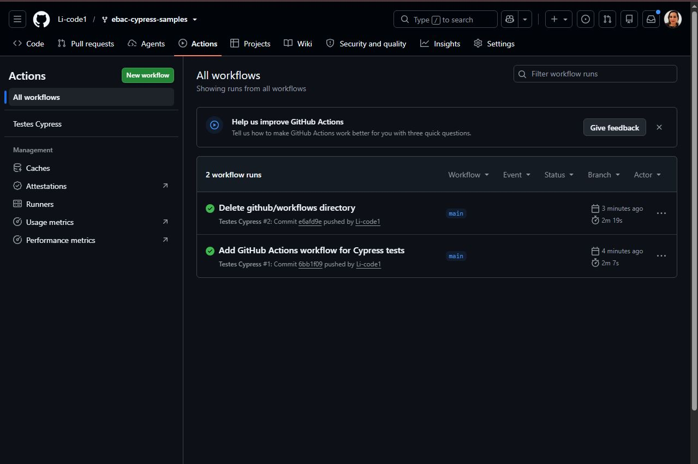

# Projeto Base - Cypress

Este é um projeto base para testes automatizados utilizando o **Cypress**.




## 🧩 Pré-requisitos

Antes de começar, certifique-se de ter instalado:

- [Node.js](https://nodejs.org/) (recomenda-se a versão **LTS**)
- [Git](https://git-scm.com/)

## 🚀 Passos para rodar o projeto

### 1. Clonar o repositório

```bash
git clone https://github.com/EBAC-QE/ebac-cypress-samples.git
```

### 2. Entrar na pasta do projeto

```bash
cd ebac-cypress-samples
```

### 3. Instalar as dependências

```bash
npm install
```

### 4. Rodar o Cypress (modo interativo)

```bash
npx cypress open
```

### 5. Rodar os testes (modo headless)

```bash
npx cypress run
```
